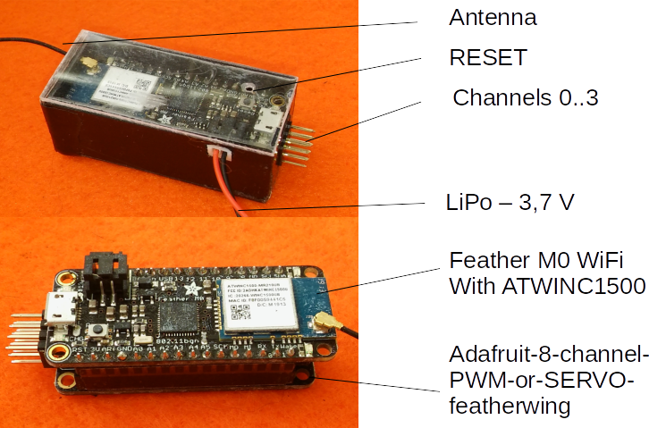

# RC-Empfänger mit Adafruit-Feather-M0-WiFi-ATWINC1500+uFL

Der Raspberry-Pi Empfänger der [RC Funkfernsteuerung](https://github.com/monbera/RC-Pi) hat folgende Nachteile:

  * Eine absulut konstante Versorgungsspannung von 5V ist erforderlich
  * Anschluss einer externen WiFi Antenne ist nur über den Umweg eines USB-WiFi Adapters möglich

Deshalb ist hier eine alternativer Emfpänger beschrieben.

Erforderliche Materialien:

  * Adafruit Feather M0 WiFi with ATWINC1500 + uFL
    (Pimoroni.com oder Adafruit.com)
  * Adafruit-8-channel-PWM-or-SERVO-featherwing
  * LiPo Empfängerbatterie mind. 500mAh
  * Elko 500uF/10 V
  * Rechtwinkliche 4*3 Stiftleiste
  * Short Feather Male Headers - 12-pin and 16-pin Male Header Set
  * Short Feather Headers Kit - 12-pin and 16-pin Female Header Set

## Aufbau des RC-Empängers
Folgend Komponenten sind einzulöten:

  * Stiftleiste auf dem M0-Board
  * Buchsenleiste auf dem PWM-Board
  * Elko 500 uF/10 V Durchmesser max. 8 mm auf dem PWM-Boad liegend
  * Rechtwinkliche 4*3 Stiftleiste für Kanäle 0..3 auf dem M0-Board

Danach sind beide Boards zusammenzustecken. Man erhält einen sehr kompakten RC-Empfänger mit bis zu 8 Kanälen.

## Installation der Software

Als erstes sollte man den Instruktionen des [Adafruit Tutorial](https://learn.adafruit.com/adafruit-feather-m0-wifi-atwinc1500) halten und alle erforderlichen Libraries des Boards installieren und die Funktionsweise mit einer einfachen Software testen.

Mit der Software SimpleTest.ino kann man das Zusammenspiel der o.g. Komponenete testen. Dazu ist der Empfänger an Kanal 0 mit einem Servo zu verbinden. An einem anderen Kanal ist zwischen GND und +V die Servo Betriebspannung 5V..6V anzulegen (z.B. BEC) und das M0-Board mit dem Rechner zu verbinden (Arduino IDE). Nach dem Laden der SW bewegt sich der Servo jeweils nach einer Sekunde.

Die Software des zur [RC Funkfernsteuerung](https://github.com/monbera/RC-Pi) kompatiblen Empängers besteht aus folgenden Komponenten:

  * M0Rx.ino - Hauptprogramm mit 'setup' und 'loop' Struktur der Arduino IDE. Im wesentlichen ist hier der UDP-Client implementiert
  * cfg.h - Konfiguration verschiedener Modelle und Kanäle und Passwort und SSID des lokalen Netzwerkes

Im eigenen Sketchbook-Verzeichnis 'libraries' sind die beiden Bibliotheken 'PCA9685' und 'MyRC' jeweils in einem gleichnamigen Verzeichnis abzulegen. In 'PCA9685' sind die absolut notwendigen Prozeduren implementiert, die zum Ansteuern des PWM-Boards notwendig sind. In 'MyRC' sind Hilfsfunktionen zur Konvertierung und Berechnung implementiert.

Alle zusätzlichen Informationen sind im Reposotory [RC Funkfernsteuerung](https://github.com/monbera/RC-Pi) beschrieben. 

# RC receiver with Adafruit-Feather-M0-WiFi-ATWINC1500+uFL

The Raspberry-Pi receiver of the [RC remote control](https://github.com/monbera/RC-Pi) has the following disadvantages:

  * An absolute constant power supply of 5V is required
  * Connection of an external WiFi antenna is only possible via a USB-WiFi adapter

Therefore an alternative receiver is described here.

Materials required:

* Adafruit Feather M0 WiFi with ATWINC1500 + uFL
    (Pimoroni.com or Adafruit.com)
  * Adafruit-8-channel-PWM-or-SERVO-featherwing
  * LiPo receiver battery min. 500mAh
  * capacitor 500uF/10 V
  * Right-angled 4*3 pin header
  * Short Feather Male Headers - 12-pin and 16-pin Male Header Set
  * Short Feather Headers Kit - 12-pin and 16-pin Female Header Set

## Construction of the RC receiver
Solder the following components:

  * pin header on the M0 board
  * female connector strip on the PWM board
  * Capacitor 500 uF/10 V diameter max. 8 mm lying on the PWM board
  * Right-angled 4*3 pin header for channels 0..3 on the M0 board

Afterwards both boards are to be plugged together. You get a very compact RC receiver with up to 8 channels.

## Installation of the software

The first thing to do is to follow the instructions of the [Adafruit Tutorial](https://learn.adafruit.com/adafruit-feather-m0-wifi-atwinc1500) and install all necessary libraries of the board and test the functionality test with a simple software.

With the software SimpleTest.ino you can test the interaction of the above mentioned components. To do this, connect the receiver to channel 0 with a servo. At another channel the servo operating voltage 5V..6V must be applied between GND and +V (e.g. BEC) and the M0 board must be connected to the computer (Arduino IDE). After loading the SW the servo moves after one second.

The software for the receiver, which is compatible with the [RC remote control](https://github.com/monbera/RC-Pi), consists of the following components:

  * M0Rx.ino - Main program with 'setup' and 'loop' structure of the Arduino IDE. Basically the UDP client is implemented here.
  * cfg.h - Configuration of different models and channels and 
    password and SSID of the local network

In the sketchbook directory 'libraries' the two libraries 'PCA9685' and 'MyRC' have to be stored in a directory with the same name. In 'PCA9685' the absolutely necessary procedures are implemented, which are necessary to control the PWM board. In 'MyRC' auxiliary functions for conversion and calculation are implemented.

All additional information is described in the repository [RC Remote Control](https://github.com/monbera/RC-Pi). 

Translated with [www.DeepL.com/Translator](www.DeepL.com/Translator) (free version)

